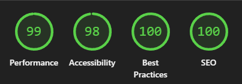

# The Awareness Project

_A calming and accessible platform for mental well-being_

---

## 🖼️ Website Mockup

<div align="center">
  
</div>

---

## 🌐 Deployed Site

[https://tbragg88.github.io/Mental-Awareness-Project/](https://tbragg88.github.io/Mental-Awareness-Project/)

---

## 📝 Project Overview

**The Awareness Project** offers beginner-friendly resources in a calming, organized, and accessible format. The site features a clean UI, smooth navigation, and interactive wellness tools to help users manage stress and learn about mental health.

### 🌟 Brief

-   Cohesive one-page layout with semantic HTML and accessible navigation
-   Information organized using UX principles and user-initiated actions with feedback
-   Valid HTML and CSS (W3C/Jigsaw)
-   Responsive design with media queries

---

## 🛠️ Features Considered But Not Included

During development, several features were explored but not included to maintain clarity, accessibility, and a calming user experience:

-   **Image Carousel:**  
    Initially planned for the hero or resource sections to showcase tips and affirmations. Removed as it disrupted the calm, focused flow of the site and could distract users seeking support.

-   **Breathing Animation:**  
    A guided breathing exercise animation was prototyped to help users manage stress. It was omitted to keep the interface simple and avoid overwhelming first-time visitors. This feature may be revisited in future updates.

-   **Live Chat Widget:**  
    Considered for instant support, but excluded to maintain privacy and reduce technical complexity for a static site.

---

## 🌓 Partial Integrations

-   **Dark/Light Mode Toggle Animation:**  
    More elaborate transitions were tested but replaced with a subtle, accessible toggle for a smoother experience.

These decisions were made to ensure the site remains approachable, fast, and easy to navigate for all users.

---

## 🖼️ Screenshots & UI Flow

Initial wireframing

<div align="center">
  
  
  
</div>

---
### **Changes to Initial Plan**  

The carousel was removed and replaced, as the animation and scope **outweighed the project timeline** and the final product **did not align well** with the content's context. Other versions were tested, but ultimately, **card usage was the best fallback solution**.  

<div align="center">
  
  
</div>

The content lacked enough density to justify implementation.

---
## 🎨 Colour Palette  

  

The color palette was selected for its **calming and accessible** qualities. Soft blues and neutral tones help create a **relaxed atmosphere**, while accent colors provide enough contrast for **clear readability**. The choices aim to support a **welcoming and easy-to-use** experience for everyone.  

**Updated to achieve a higher accessibility score by incorporating slightly more contrasting tones.**

---
## ✨ Features

The Awareness Project delivers a focused set of features designed for clarity, accessibility, and a calming user experience:

- **Responsive Navigation Bar:**  
  The navigation adapts seamlessly across devices, ensuring intuitive access whether on desktop or mobile. Both light and dark modes are supported for user comfort.

  <div align="center">
    <br/>
    <br/>
    <br/>
    
  </div>

- **Hero Images:**  
  Custom hero images are used for both desktop and mobile, preloaded for faster performance and optimized for clarity.

  <div align="center">
    
    
  </div>

- **Info Section Images:**  
  Informational sections feature supportive imagery to visually reinforce key concepts, with alt text for accessibility.

  <div align="center">
    
    
  </div>

- **Resources Images:**  
  Resource cards are designed for clarity and quick access, with concise content and icons that remain easy to read and engage with—even on smaller screens. 
  
  <div align="center">
    
    <br/>
    
  </div>

- **Footer Images:**  
  The footer contains all essential links to the website, including external donation pages and social media profiles, while maintaining subtle, calming visuals and icons for a cohesive and welcoming look throughout the site.
  
   <div align="center">
    
    
  </div>

 
## 🚀 How AI Was Used

Artificial Intelligence played a crucial role in shaping this project, streamlining development, and improving overall efficiency. Here’s how AI was leveraged:

1. **Code Generation:**  
   AI-powered tools, such as **GitHub Copilot**, provided structured HTML and CSS code snippets, streamlining development. "A manual review ensured code quality. In the end, I mainly used an external Copilot for 'How can I do X?' rather than letting VS Code's internal Copilot indiscriminately shotgun lines."
2. **Debugging & Optimization:**  
   AI debugging tools detected errors and suggested solutions, minimizing bugs and improving stability.
   "The W3C Markup Validation Service was great for identifying issues and bad coding practices. Lighthouse was particularly helpful in assessing accessibility and ensuring sufficient text contrast for an inclusive experience."

3. **AI-Generated Imagery:**  
   **DALL-E** was used to generate all images for the website, ensuring consistency and creativity.
   "This was great from start to finish. As someone with little artistic talent, it provided me with enough guidance to create an aesthetic that flowed nicely."

4. **Content Assistance:**  
   **GitHub Copilot** aided in text refinement, delivering real-time suggestions for blurbs and content. "Again, this is completely true—I wrote nothing on the page. Every paragraph, inspirational message, and aspiration came entirely from the AI, and it was both cohesive and comprehensive."

5. **Accessibility Improvements:**  
   Tools like **Lighthouse** assessed accessibility features and provided recommendations for a user-friendly experience. "Not only was Lighthouse useful, but the built-in Copilot was also effective at formatting and validation. It highlighted best practices for aria-label placement and suggested accessibility improvements. It was very good at that."

    ***

## 🧪 Testing & Validation

### Initial Testing

-   **HTML & CSS Validation:**  
    All pages were validated using the [W3C Markup Validation Service](https://validator.w3.org/) and [W3C CSS Validator](https://jigsaw.w3.org/css-validator/) to ensure standards compliance and accessibility:

    <div align="center">
      
      
    </div>

    _Tip: Images between 300–400px wide are generally clear and readable in most README views. Adjust as needed for your preferred layout._

### **Accessibility Checks**

[Lighthouse](https://developers.google.com/web/tools/lighthouse) was used to assess accessibility, color contrast, and best practices.

<div align="center">
    <br/>
    <sub>Mobile Lighthouse Accessibility Report</sub>
    <br/><br/>
    
    <br/>
    <sub>Desktop Lighthouse Color Contrast Report</sub>
    <br/><br/>
    
</div>

### **Initial Testing Findings**

-   **Performance Issue:**  
  The mobile hero image caused mild lag, lowering performance scores. **Preloading and resizing** the image for mobile screens is recommended.

-   **Accessibility Issues:**  
  Both Lighthouse reports highlighted contrast issues due to the use of **gray text**, impacting readability.

<div align="center">
  <br/>
  <sub>Mobile Lighthouse Accessibility Report (Updated)</sub>
  <br/><br/>
  
  <br/>
  <sub>Desktop Lighthouse Color Contrast Report (Updated)</sub>
  <br/><br/>
  
</div>

### **Performance**

A mobile-optimized header image was created, and both headers are now preloaded. While this has improved performance, some lag persists with other images and files—specifically on mobile, which is less than ideal.

### **Accessibility**

Switching neutral grays to black and darkening some blues significantly improved accessibility scores.

### **Best Practices**

the "burger" and nightmode toggler was causing problems, but with copilot we managed to streamline them to achieve perfect scores

<div align="center">
  
</div>

### **Manual Testing**

Manual testing was performed on **Chrome** and **Firefox** (4K and 1080p monitors) and an **iPhone 13** to ensure consistent experience across devices.

## 🛠️ Local Development Setup

1. **Clone the repository:**
    ```bash
    git clone https://github.com/TBragg88/Mental-Awareness-Project
    ```
2. **Open in browser:**
    - **Mac:** `open index.html`
    - **Windows:** `start index.html`

---

## 🌍 Hosting & Deployment

-   **GitHub Pages:**  
    Deploy from the main branch via repository settings.
-   **Alternative:**  
    Netlify or similar static site hosts.

---

## 📜 Attribution & Credits

-   [Bootstrap](https://getbootstrap.com/) for layout
-   [Font Awesome](https://fontawesome.com/) for icons
-   [DALL-E](https://openai.com/dall-e) for AI-generated images
-   [GitHub Copilot](https://github.com/features/copilot) for code and content assistance
-   [W3C Markup Validation Service](https://validator.w3.org/) and [W3C CSS Validator](https://jigsaw.w3.org/css-validator/) for code validation
-   [Lighthouse](https://developers.google.com/web/tools/lighthouse) for accessibility and performance testing
-   External mental health resources for content accuracy
